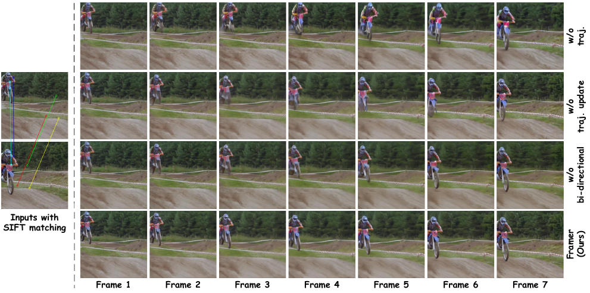
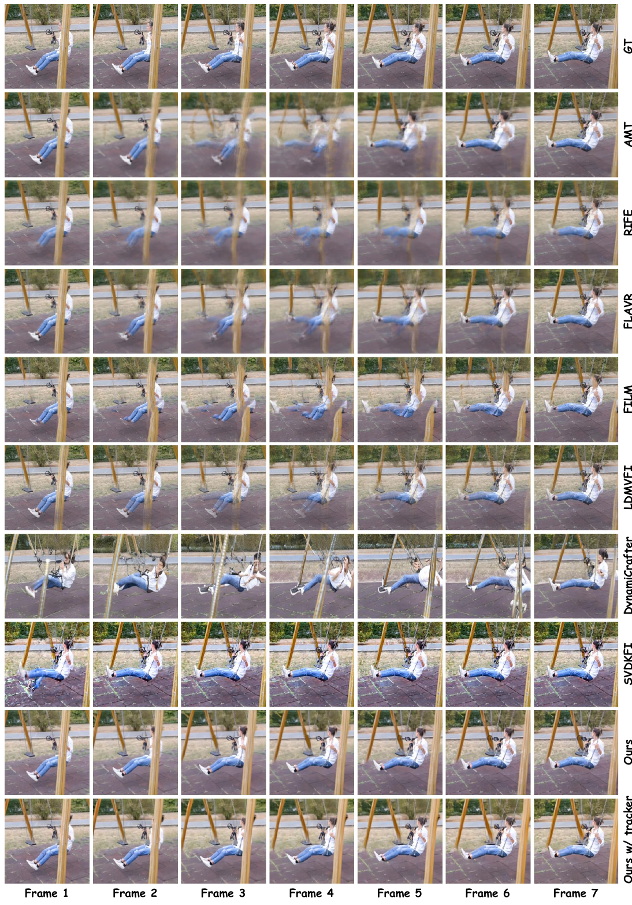
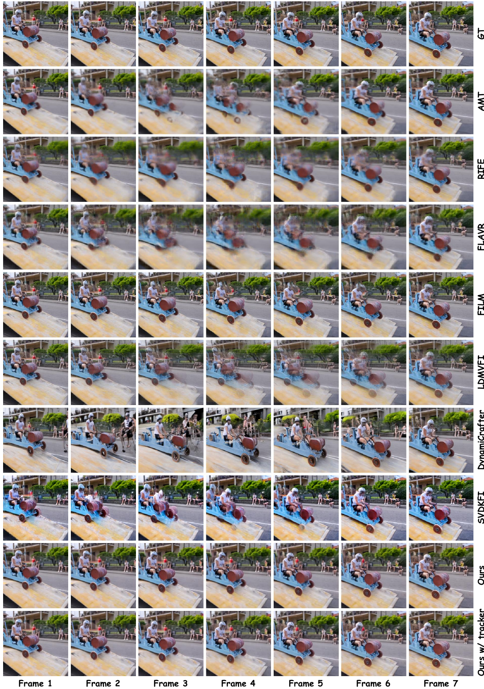
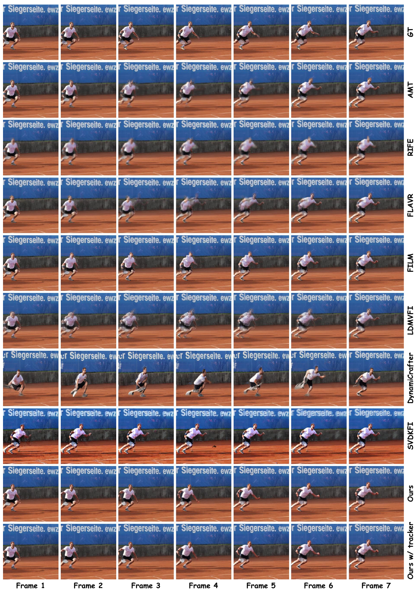
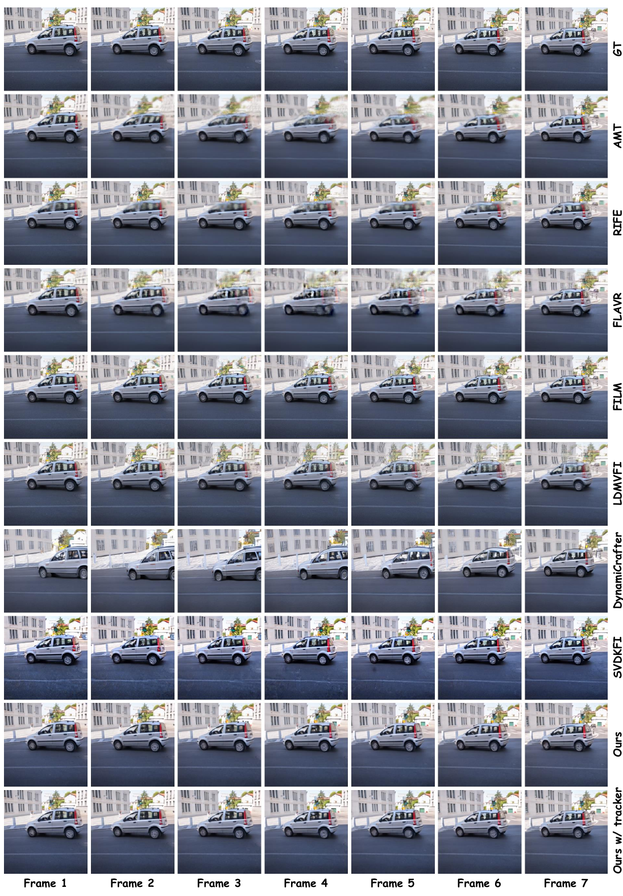

### TL;DR



Framer is a novel interactive frame interpolation method that lets users customize transitions between two images by manipulating keypoints. It uses a pre-trained video diffusion model and provides both interactive and automated modes, demonstrating improved results in image morphing, video generation, and other applications.




 &nbsp; read the paper on arXiv


#### Why does this paper matter?
This paper introduces Framer, an interactive frame interpolation method that allows users to customize the transition between two images by manipulating keypoints.  It leverages a pre-trained video diffusion model and offers both interactive and automated modes.  The results demonstrate improved quality and control over the interpolation process, showcasing applications in various fields.
#### Key Takeaways


 Framer offers interactive control over frame interpolation by allowing users to adjust keypoint trajectories. 



 Framer includes an "autopilot" mode that automatically estimates and refines keypoint trajectories. 



 Framer demonstrates high-quality results across various applications, outperforming existing methods in subjective user studies. 


------
#### Visual Insights

. Moreover, Framer handles challenging cases and can realize smooth image morphing (last 2 rows). The input trajectories are overlayed on the frames.")


|  | DAVIS-7 | DAVIS-7 | DAVIS-7 | DAVIS-7 | UCF101-7 | UCF101-7 | UCF101-7 | UCF101-7 | UCF101-7 | UCF101-7 |
| --- | --- | --- | --- | --- | --- | --- | --- | --- | --- | --- |
|  | PSNR↑ | SSIM↑ | LPIPS↓ | FID↓ | FVD↓ | PSNR↑ | SSIM↑ | LPIPS↓ | FID↓ | FVD↓ |
| AMT (Li et al., 2023) | 21.66 | 0.7229 | 0.2860 | 39.17 | 245.25 | 26.64 | 0.9000 | 0.1878 | 37.80 | 270.98 |
| RIFE (Huang et al., 2020) | 22.00 | 0.7216 | 0.2663 | 39.16 | 319.79 | 27.04 | 0.9020 | 0.1575 | 27.96 | 300.40 |
| FLAVR Kalluri et al. (2023) | 20.94 | 0.6880 | 0.3305 | 52.23 | 296.37 | 26.50 | 0.8982 | 0.1836 | 37.79 | 279.58 |
| FILM (Reda et al., 2022) | 21.67 | 0.7121 | 0.2191 | 17.20 | 162.86 | 26.74 | 0.8983 | 0.1378 | 16.22 | 239.48 |
| LDMVFI (Danier et al., 2024) | 21.11 | 0.6900 | 0.2535 | 21.96 | 269.72 | 26.68 | 0.8955 | 0.1446 | 17.55 | 270.33 |
| DynamicCrafter (Xing et al., 2023) | 15.48 | 0.4668 | 0.4628 | 35.95 | 468.78 | 17.62 | 0.7082 | 0.3361 | 61.71 | 646.91 |
| SVDKFI (Wang et al., 2024a) | 16.71 | 0.5274 | 0.3440 | 26.59 | 382.19 | 21.04 | 0.7991 | 0.2146 | 44.81 | 301.33 |
| Framer (Ours) | 21.23 | 0.7218 | 0.2525 | 27.13 | 115.65 | 25.04 | 0.8806 | 0.1714 | 31.69 | 181.55 |
| Framer with Co-Tracker (Ours) | 22.75 | 0.7931 | 0.2199 | 27.43 | 102.31 | 27.08 | 0.9024 | 0.1714 | 32.37 | 159.87 |


------

More on figures

 a user-interactive mode for customized point trajectories and (b) an 'autopilot' mode for video frame interpolation without trajectory inputs. During training, (d) we fine-tune the 3D-UNet of a pre-trained video diffusion model for video frame interpolation. Afterward, (c) we introduce point trajectory control by freezing the 3D-UNet and fine-tuning the controlling branch.")

. Moreover, Framer handles challenging cases and can realize smooth image morphing (last 2 rows). The input trajectories are overlayed on the frames.")

. Moreover, Framer handles challenging cases and can realize smooth image morphing (last 2 rows). The input trajectories are overlayed on the frames.")

. Moreover, Framer handles challenging cases and can realize smooth image morphing (last 2 rows). The input trajectories are overlayed on the frames.")

. Moreover, Framer handles challenging cases and can realize smooth image morphing (last 2 rows). The input trajectories are overlayed on the frames.")

. Moreover, Framer handles challenging cases and can realize smooth image morphing (last 2 rows). The input trajectories are overlayed on the frames.")

 cartoon and (b) sketch interpolation.")

. Moreover, Framer handles challenging cases and can realize smooth image morphing (last 2 rows). The input trajectories are overlayed on the frames.")

. Moreover, Framer handles challenging cases and can realize smooth image morphing (last 2 rows). The input trajectories are overlayed on the frames.")

. Moreover, Framer handles challenging cases and can realize smooth image morphing (last 2 rows). The input trajectories are overlayed on the frames.")

------

------

More on tables


| Tianyu Ding, Luming Liang, Zhihui Zhu, and Ilya Zharkov. CDFI: compression-driven network design for frame interpolation. In IEEE Conf. Comput. Vis. Pattern Recog., 2021. |
| --- |
| Jiong Dong, Kaoru Ota, and Mianxiong Dong. Video frame interpolation: A comprehensive survey. ACM Trans. Multim. Comput. Commun. Appl., 2023. |
| Haiwen Feng, Zheng Ding, Zhihao Xia, Simon Niklaus, Victoria Fernandez Abrevaya, Michael J. Black, and Xuaner Zhang. Explorative inbetweening of time and space. arXiv: Computing Research Repo., abs/2403.14611, 2024. |
| Songwei Ge, Seungjun Nah, Guilin Liu, Tyler Poon, Andrew Tao, Bryan Catanzaro, David Jacobs, Jia-Bin Huang, Ming-Yu Liu, and Yogesh Balaji. Preserve your own correlation: A noise prior for video diffusion models. In Int. Conf. Comput. Vis., 2023. |
| Shurui Gui, Chaoyue Wang, Qihua Chen, and Dacheng Tao. Featureflow: Robust video interpolation via structure-to-texture generation. In IEEE Conf. Comput. Vis. Pattern Recog., 2020. |
| Yuwei Guo, Ceyuan Yang, Anyi Rao, Maneesh Agrawala, Dahua Lin, and Bo Dai. Sparsectrl: Adding sparse controls to text-to-video diffusion models. arXiv: Computing Research Repo., abs/2311.16933, 2023. |
| Hao He, Yinghao Xu, Yuwei Guo, Gordon Wetzstein, Bo Dai, Hongsheng Li, and Ceyuan Yang. Cameractrl: Enabling camera control for text-to-video generation. arXiv: Computing Research Repo., abs/2404.02101, 2024. |
| Zhewei Huang, Tianyuan Zhang, Wen Heng, Boxin Shi, and Shuchang Zhou. RIFE: real-time intermediate flow estimation for video frame interpolation. arXiv: Computing Research Repo., abs/2011.06294, 2020. |
| Siddhant Jain, Daniel Watson, Eric Tabellion, Aleksander Holynski, Ben Poole, and Janne Kontkanen. Video interpolation with diffusion models. arXiv: Computing Research Repo., abs/2404.01203, 2024. |
| Huaizu Jiang, Deqing Sun, Varun Jampani, Ming-Hsuan Yang, Erik G. Learned-Miller, and Jan Kautz. Super slomo: High quality estimation of multiple intermediate frames for video interpolation. In IEEE Conf. Comput. Vis. Pattern Recog., 2018. |
| Xin Jin, Longhai Wu, Guotao Shen, Youxin Chen, Jie Chen, Jayoon Koo, and Cheul-Hee Hahm. Enhanced bi-directional motion estimation for video frame interpolation. In IEEE Winter Conf. Appl. Comput. Vis., 2023. |
| Tarun Kalluri, Deepak Pathak, Manmohan Chandraker, and Du Tran. FLAVR: flow-agnostic video representations for fast frame interpolation. In IEEE Winter Conf. Appl. Comput. Vis., 2023. |
| Nikita Karaev, Ignacio Rocco, Benjamin Graham, Natalia Neverova, Andrea Vedaldi, and Christian Rupprecht. Cotracker: It is better to track together. arXiv: Computing Research Repo., abs/2307.07635, 2023. |
| Lingtong Kong, Boyuan Jiang, Donghao Luo, Wenqing Chu, Xiaoming Huang, Ying Tai, Chengjie Wang, and Jie Yang. Ifrnet: Intermediate feature refine network for efficient frame interpolation. In IEEE Conf. Comput. Vis. Pattern Recog., 2022. |
| Hyeongmin Lee, Taeoh Kim, Tae-Young Chung, Daehyun Pak, Yuseok Ban, and Sangyoun Lee. Adacof: Adaptive collaboration of flows for video frame interpolation. In IEEE Conf. Comput. Vis. Pattern Recog., 2020. |
| Changlin Li, Guangyang Wu, Yanan Sun, Xin Tao, Chi-Keung Tang, and Yu- Wing Tai. H-VFI: hierarchical frame interpolation for videos with large motions. arXiv: Computing Research Repo., abs/2211.11309, 2022. |
| Zhen Li, Zuo-Liang Zhu, Linghao Han, Qibin Hou, Chun-Le Guo, and Ming-Ming Cheng. AMT: all-pairs multi-field transforms for efficient frame interpolation. In IEEE Conf. Comput. Vis. Pattern Recog., 2023. |



|  | DAVIS-7 | DAVIS-7 | DAVIS-7 | DAVIS-7 | DAVIS-7 | UCF101-7 | UCF101-7 | UCF101-7 | UCF101-7 | UCF101-7 |
| --- | --- | --- | --- | --- | --- | --- | --- | --- | --- | --- |
|  | PSNR↑ | SSIM↑ | LPIPS↓ | FID↓ | FVD↓ | PSNR↑ | SSIM↑ | LPIPS↓ | FID↓ | FVD↓ |
| w/o trajectory | 20.19 | 0.6831 | 0.2787 | 28.25 | 128.71 | 24.16 | 0.8677 | 0.1798 | 32.64 | 195.54 |
| w/o traj. updating | 20.82 | 0.7054 | 0.2621 | 27.33 | 120.73 | 24.69 | 0.8748 | 0.1842 | 31.95 | 187.37 |
| w/o bi-directional | 20.94 | 0.7102 | 0.2602 | 27.23 | 116.81 | 24.73 | 0.8746 | 0.1845 | 31.66 | 183.74 |
| Framer (Ours) | 21.23 | 0.7218 | 0.2525 | 27.13 | 115.65 | 25.04 | 0.8806 | 0.1714 | 31.69 | 181.55 |



|  | DAVIS-7 (mid-frame) | DAVIS-7 (mid-frame) | DAVIS-7 (mid-frame) | DAVIS-7 (mid-frame) | UCF101-7 (mid-frame) | UCF101-7 (mid-frame) | UCF101-7 (mid-frame) | UCF101-7 (mid-frame) |
| --- | --- | --- | --- | --- | --- | --- | --- | --- |
| PSNR↑ | SSIM↑ | LPIPS↓ | FID↓ | PSNR↑ | SSIM↑ | LPIPS↓ | FID↓ |  |
| w/o trajectory | 19.30 | 0.6504 | 0.3093 | 57.10 | 23.14 | 0.8523 | 0.1967 | 54.98 |
| w/o traj. updating | 19.84 | 0.6700 | 0.2935 | 55.37 | 23.60 | 0.8590 | 0.2009 | 53.83 |
| w/o bi-directional | 19.95 | 0.6739 | 0.2919 | 54.75 | 23.65 | 0.8586 | 0.2016 | 53.54 |
| Framer (Ours) | 20.18 | 0.6850 | 0.2845 | 55.13 | 23.92 | 0.8646 | 0.1889 | 53.33 |



|  | DAVIS-7 (mid-frame) | DAVIS-7 (mid-frame) | DAVIS-7 (mid-frame) | DAVIS-7 (mid-frame) | UCF101-7 (mid-frame) | UCF101-7 (mid-frame) | UCF101-7 (mid-frame) | UCF101-7 (mid-frame) |
| --- | --- | --- | --- | --- | --- | --- | --- | --- |
|  | PSNR↑ | SSIM↑ | LPIPS↓ | FID↓ | PSNR↑ | SSIM↑ | LPIPS↓ | FID↓ |
| AMT (Li et al⌀, 2023) | 20.59 | 0.6834 | 0.3564 | 100.36 | 25.24 | 0.8837 | 0.2237 | 75.97 |
| RIFE (Huang et al., 2020) | 20.74 | 0.6813 | 0.3102 | 80.78 | 25.68 | 0.8842 | 0.1835 | 59.33 |
| FLAVR Kalluri et al. (2023) | 19.93 | 0.6514 | 0.4074 | 118.45 | 24.93 | 0.8796 | 0.2164 | 79.86 |
| FILM (Reda et al., 2022) | 20.28 | 0.6671 | 0.2620 | 48.70 | 25.31 | 0.8818 | 0.1623 | 41.23 |
| LDMVFI (Danier et al., 2024) | 19.87 | 0.6435 | 0.2985 | 56.46 | 25.16 | 0.8789 | 0.1695 | 43.01 |
| DynamicCrafter (Xing et al., 2023) | 14.61 | 0.4280 | 0.5082 | 77.65 | 17.05 | 0.6935 | 0.3502 | 97.01 |
| SVDKFI (Wang et al., 2024a) | 16.06 | 0.4974 | 0.3719 | 53.49 | 20.03 | 0.7775 | 0.2326 | 69.26 |
| Framer (Ours) | 20.18 | 0.6850 | 0.2845 | 55.13 | 23.92 | 0.8646 | 0.1889 | 53.33 |
| Framer with Co-Tracker (Ours) | 21.94 | 0.7693 | 0.2437 | 55.77 | 25.86 | 0.8868 | 0.1873 | 54.64 |


------

